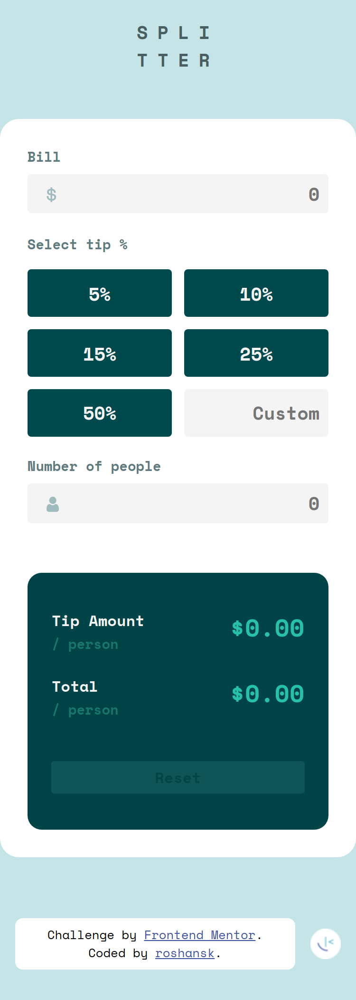
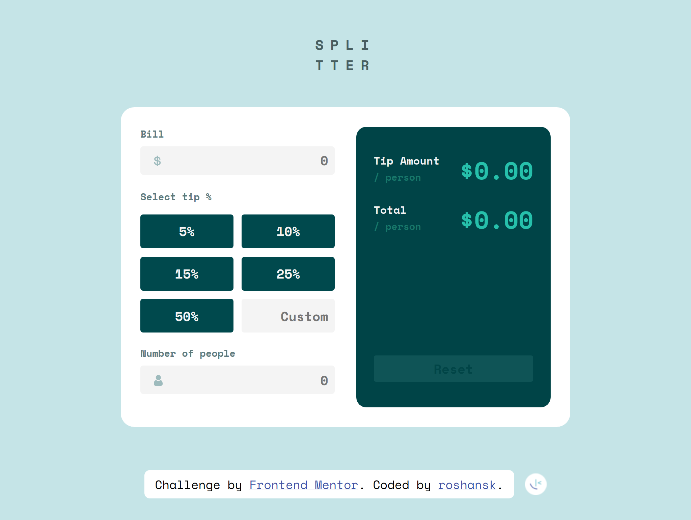
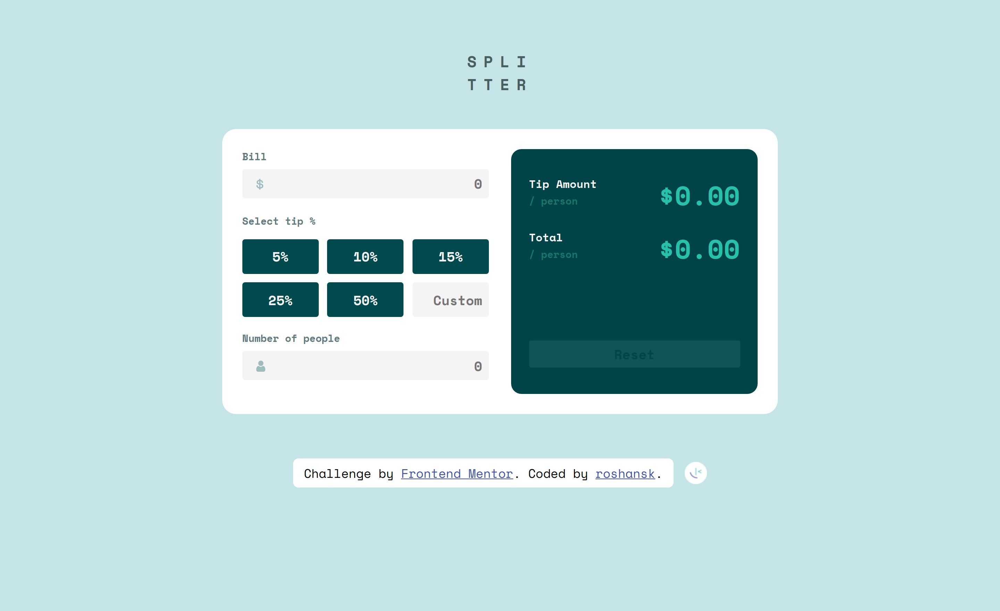

# Frontend Mentor - Tip calculator app solution

This is a solution to the [Tip calculator app challenge on Frontend Mentor](https://www.frontendmentor.io/challenges/tip-calculator-app-ugJNGbJUX).

## Table of contents

- [The challenge](#the-challenge)
- [Screenshot](#screenshot)
- [Links](#links)
- [Built with](#built-with)
- [Author](#author)

### The challenge

Users should be able to:

- View the optimal layout for the app depending on their device's screen size
- See hover states for all interactive elements on the page
- Calculate the correct tip and total cost of the bill per person

### Screenshot

- Mobile: 375px

  

- Tablet: 786px

- Desktop: 1024px

- Desktop: 1440px

### Links

- [Solution URL]()
- [Live site](https://roshansk.github.io/FrontendMentor-TipCalculator)

### Built with

- Semantic HTML5 markup
- CSS custom properties
- Flexbox
- CSS Grid
- Mobile-first workflow
- Vanilla Js

## Author

- Frontend Mentor - [@roshansk](https://www.frontendmentor.io/profile/roshansk)

